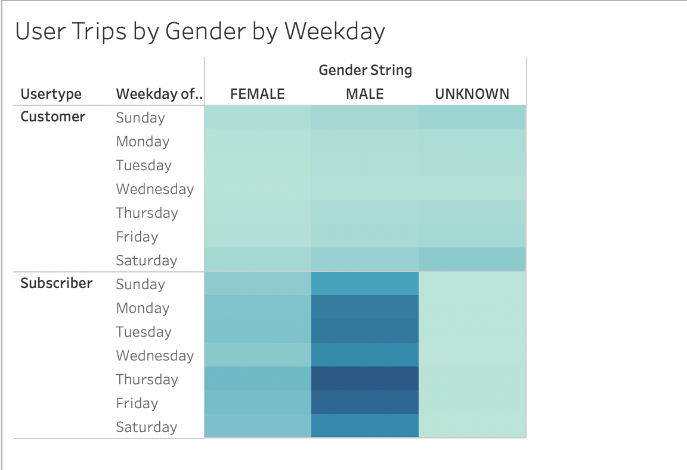
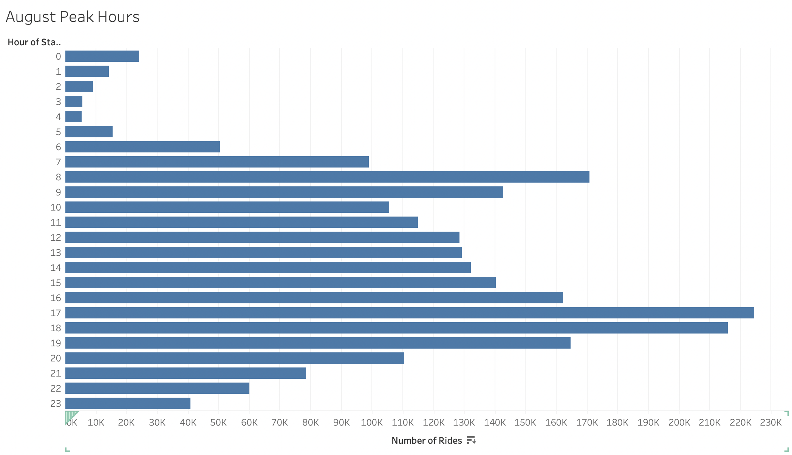
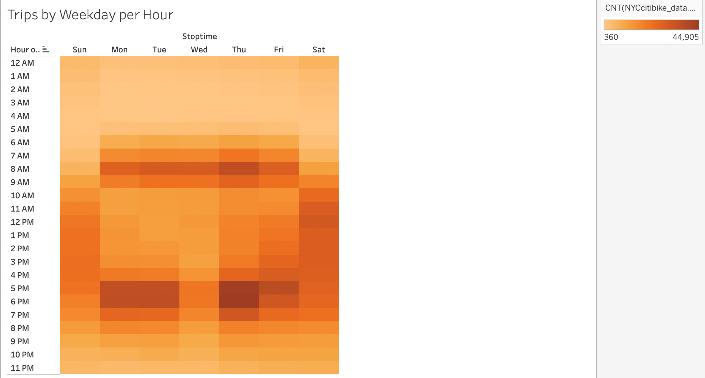
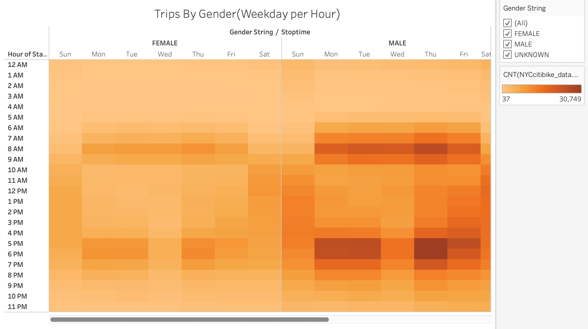
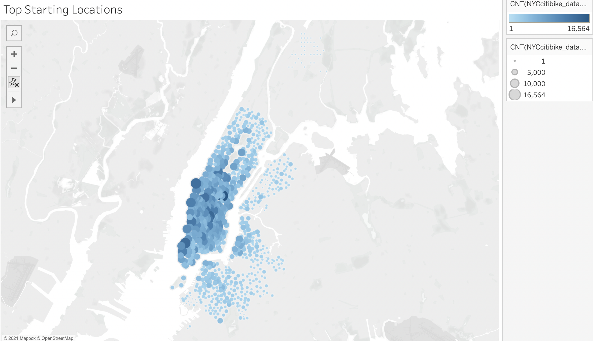
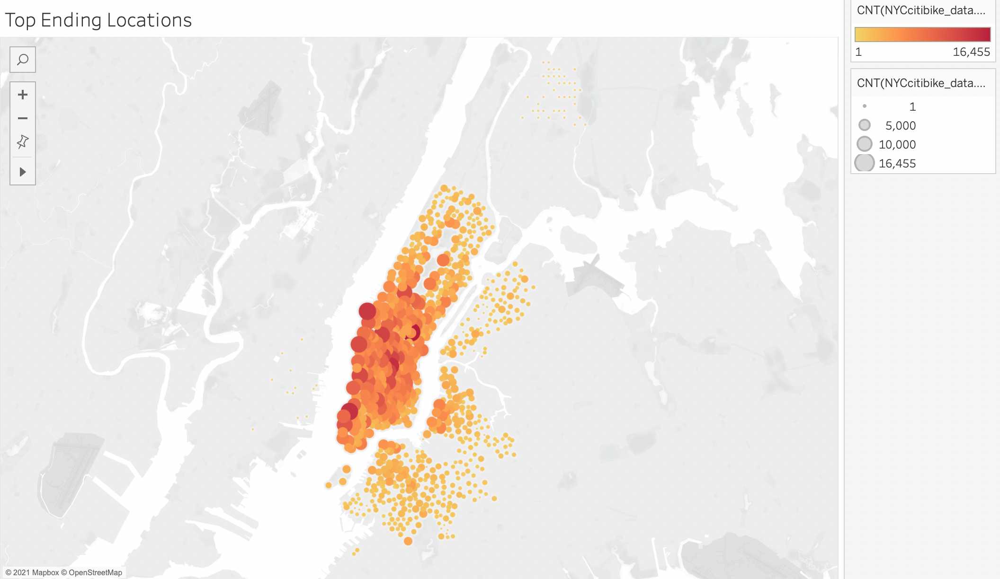
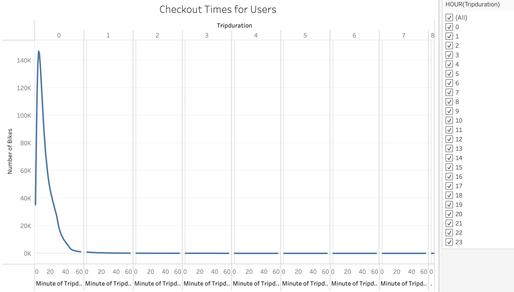
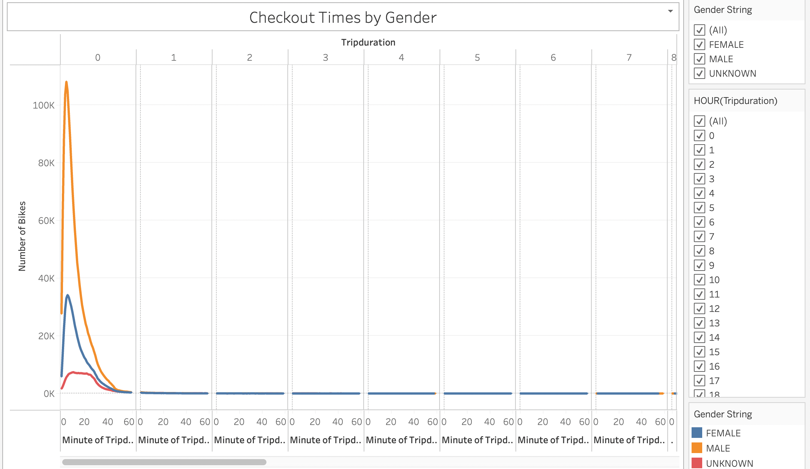

# Bikesharing Analysis Project

## __Overview:__

The purpose of this project is to analyze New York City's citibike bikesharing data to get key insights into their business.The information from this analysis would help our client decide if starting a bikesharing business in Des Moines, Iowa would be a viable.

## __Analysis and Results:__

The New York City citibike data from the month of August 2019 has been used to perform the analysis. Tableau has been used to visualize the analysis.

The following visualizations have been created.

1. ### __Citibike Users - Usage Distribution__

From this visualization, it can be seen that:

-  Among the users of the bikes, it is the citibike subcribers who use them more than other customers. 
- There are significantly more male users than female users of citibikes
-  Bike usage is highest on Thursday through the weekends, rather than on other days.
- Among male subscribers, the usage is more evenly distributed through the week as a subtantial number of them use the service on Monday and Tuesday as well.

2. ### __August Peak Hours__

- This chart shows that the peak hours of bike usage are between 4 PM and 7 PM.
- It can also be seen that 8 am to 10 am in the mornings are also quite busy.
- The least busy period is from 2 am to 4 am which would be an ideal time for bike maintenance.

3. ### __Trips per Hour by Weekday__

- From this heatmap chart, it can be observed that Thursdays through Saturdays are busy days of the week for the bikesharing business.
- Also the busiest times of the day for bikesharing are from 8 am to 9 am and from 5 pm to 7 pm.
- Wednesdays are least busy when itcomes to bike usage.

4. ### __Trips per Hour by Weekday by Gender__

- The heatmap shows that there is a significantly larger number of male users than female users of NY citibikes.
- This chart is also consistent with the other charts with the busiest period being 5pm to 7pm and 8am to 9 am and on Thursdays.
- It can be observed that the differences in usage by hour is much more pronounced among male users than female users.

5. ### __Top Starting Locations__

- This map shows which locations are the busiest and the most popular starting locations for bikesharing.
- It can be seen that certain locations and belts like Manhattan have significantly greater number of rides than say Queens or Brooklyn.
- Also, even though there is a difference between the locations, the numbers are still reasonably good for the bikesharing business in New York. The only places that have very few numbers are a bit remote from the central New York area.

6. ### __Top Ending Locations__

- The map shows the busiest ending locations for the bikesharing rides. 
- The results and trends are pretty similar to the Top Starting locations.
- There are certain specific belts which are higher in popularity and have more bike users than other locations.

7. ### __Trip Duration Distribution__

- This graph shows the distribution of most common checkout durations for the bikes.
- It can be seen that the maximum number of bike rides last for a duration of 5 to 6 minutes.
- Also most users checkout bikes for durations between 1 to 60 minutes.
- There is an inverse relationship between the trip duration and the number of rides. As the trip duration increases the number of rides decreases.
- There are still some users that checkout bikes for 2 hours and over although they are much less in number.

8. ### __Trip Duration Distribution by Gender__

- This graph shows the gender wise distribution of trip duration and it follows a similar pattern as the previous graph.
- In general, as discussed in the previous visualizations, the number of male users is much higher than female users.
- Majority of both male and female users checkout bikes for a duration of 5 to 6 minutes.
- As far as trips over 1 hour are concerned there is good representation of both male and female population, although the overall numbers are lesser for both genders, when compared to trips below 1 hour in duration.

## __Summary:__

The key takeaways from this analysis are:

- Citibike subscribers continue to remain loyal to the service and use it more than other customers.
- The bikes are used more by the male population than female.
- Thursdays through the weekend is the busiest time for citibikes.
- The peak hours of usage amidst all categories of users are from 5 pm to 7 pm and from 8 am to 9am.
- The majority of users, among all categories,checkout the bike for a duration of 5-6 minutes. There are significantly lesser number of users who use the bike for longer than an hour.
- There are specific locations where the usage of bikes is a lot more than others. The nature of these locations can be analysed further to see if they are tourist destinations or work locations.

The following additional visualizatons may be helpful in getting further insights into the NYC bikesharing business.
1. Since the birth year of users is available as part of the data, graphs can be created to show bike usage by age. Visualizations could include Trips per day, by hour by age group and Trip Duration by Age.
2. Another visualization could be that of bike usage by BikeID. This would indicate what types of bikes are more popular and checked out more often, so that the bikesharing company could tailor their products accordingly.
3. Further analysis could be made on the Starting and Ending Locations by gender and age group to determine what locations are popular among each category of users to ensure availability of bikes accordingly.

